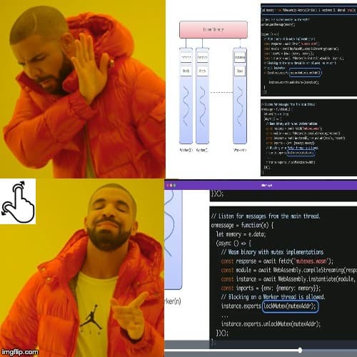
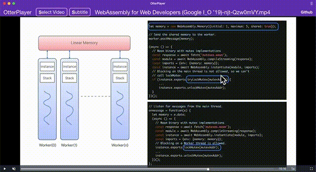

# OtterPlayer


# What is OtterPlayer ？
- **OtterPlayer** is an web base video player for **local video file**
- `Offline supported`
- `PWA Installable (chrome)`.

# Why OtterPlayer 
  Why? As a **MacBook** user, I heavily relay on **finger zoom in** feature when watch tech video. It's annoying me that any macOS video player App can not **finger zoom in**, So I creat **OtterPlayer** for myself to watch local file.

<p align="center">
  
  
</p>

## shortcuts
- `K || Space` key = start/pause
- `L || Right Arrow` key = fast-forward 15 seconds
- `J || Left Arrow` key = back-forward 15 seconds
- `Up Arrow` key = higher volume
- `Down Arrow` key = lower volume

### 20200627
- set App layout as flexbox
- add UI logic
  - hide Header and cursor when `videojs` in `vjs-playing` and `vjs-user-inactive` status
- fix few bugs, rename better variable name

### 20200516
- add cursor styling logic
  - hide cursor on `<video />` tag aften 3 seconds later when video start playing for better usability.

### 20200205
add text for re-trigger `Actions`, cuz there are no re-try feature...

### 20191219
- add `shortcut`
  - `K` key = start/pause
  - `L` key = fast-forward 15 seconds
  - `J` key = back-forward 15 seconds
### 20191211
- update readme

### 20191210
- upload **github page**

### 20191209
- add `videojs`

## todos
- minize js bundler
  - choose `preactjs`
- ~~add `videojs`~~
- hide appBar when playing video
  - maybe need A state when playing, update state, pass into appBar
  - how to add `state` in `preactjs` ?
- add button load local file
- list format support
- add WHY?
  > As an MacBook user, I heavily relay on **zoom in** feature when watching youtube. All of Mac video player App can not do it, but **browser can**. Let why I create this.
  - create GIF, pic meme
- add HOW to install
  - prerequire Chrome, firefox
  - open PWA
  - install
  - mobile safari?
- ~~add github~~
  - Lincense Apache-2? MIT?
- add issue report
- add i18n ?
- ~~upload github page!?~~
  - ~~others infra? see picture from `statesofjs jsconfjp`~~
  - ~~add CD (trigger when merge into master branch)~~
- add SEO?
- add LOGO
- update README
  - mainly for user, issue report (github issue or email)
  - secondly for developer
- test drag file on App Icon, what thing will happen?


## CLI Commands

``` bash
# install dependencies
npm install

# serve with hot reload at localhost:8080
npm run dev

# build for production with minification
npm run build

# test the production build locally
npm run serve

# run tests with jest and preact-render-spy
npm run test
```

For detailed explanation on how things work, checkout the [CLI Readme](https://github.com/developit/preact-cli/blob/master/README.md).
